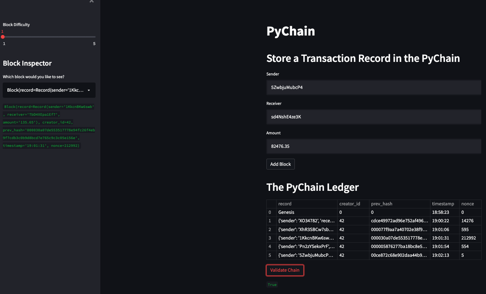

# PyChain Ledger

## Description
In this project, I have taken on the role of a fintech engineer. My task is to build a blockchain-based ledger system, complete with a user-friendly web interface. This ledger allows partner banks to conduct financial transactions (that is, to transfer money between senders and receivers) and to verify the integrity of the data in the ledger.

## Libraries
This project requires streamlit, dataclasses, typing, datetime, pandas and hashlib

## Running Streamlit Web Interface
1. In the terminal, navigate to the folder where `pychain.py` is stored.

2. In the terminal, run the Streamlit application by using `streamlit run pychain.py`.

3. Enter values for the sender, receiver, and amount, and then click the "Add Block" button. You can do this several times to store several blocks in the ledger. You can even toggle the block difficulty with the slider on the lefthand side of the web interface.

4. Verify the block contents and hashes in the Streamlit dropdown menu.

5. Test the blockchain validation process by clicking the 'Validate Chain' button.

# PyChain Demo
For video demo of the streamlit web interface, download `PyChain-demo.mov` in this repository.

# Streamlit Web Interface Screenshot
